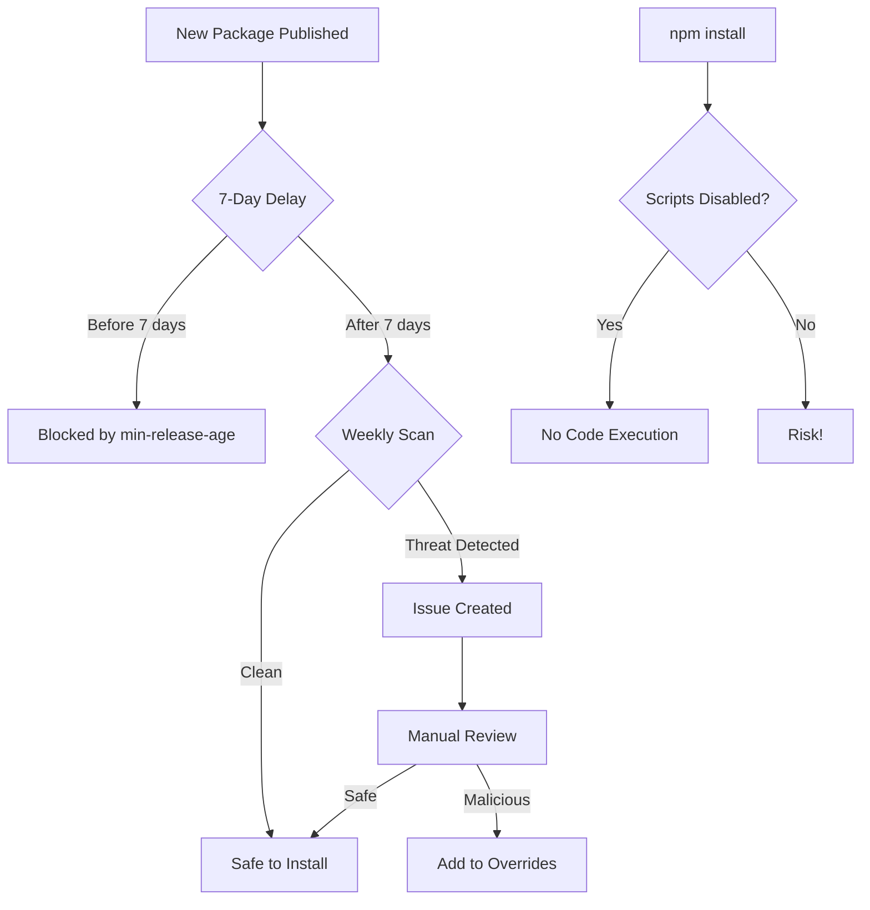

# Supply Chain Attack Protection - April 2026

## 🚨 Active Threats (Last Updated: April 6, 2026)

### Recently Compromised Packages

| Package | Compromised Versions | Attack Type | Detected | Status |
|---------|---------------------|-------------|----------|--------|
| **strapi-plugin-health** | Unknown | Supply chain attack | April 3, 2026 | ✅ PROTECTED |
| **strapi-plugin-sync** | Unknown | Supply chain attack | April 3, 2026 | ✅ PROTECTED |
| **strapi-plugin-seed** | Unknown | Supply chain attack | April 3, 2026 | ✅ PROTECTED |
| **strapi-plugin-locale** | Unknown | Supply chain attack | April 3, 2026 | ✅ PROTECTED |
| **strapi-plugin-form** | Unknown | Supply chain attack | April 3, 2026 | ✅ PROTECTED |
| **strapi-plugin-notify** | Unknown | Supply chain attack | April 3, 2026 | ✅ PROTECTED |
| **strapi-plugin-api** | Unknown | Supply chain attack | April 3, 2026 | ✅ PROTECTED |
| **mgc** | 1.2.1-1.2.4 | GitHub-hosted payloads, C2 active | April 3, 2026 | ✅ PROTECTED |
| **axios** | 1.14.1, 0.30.4 | Malicious dependency injection | March 31, 2026 | ✅ PROTECTED |
| **axios** (2nd attack) | Unknown | UNC1069 social engineering | April 3, 2026 | ✅ PROTECTED |
| **LiteLLM** | 1.82.7, 1.82.8 | Credential exfiltration backdoor | April 1, 2026 | ✅ PROTECTED |
| **separadordeinfocc** | 1.0.0 | LofyGang malware/infostealer | April 1, 2026 | ✅ PROTECTED |
| **Railway** | N/A | CDN caching data leak | March 2026 | ℹ️ External service |
| **OpenAI Codex** | N/A | Command injection vulnerability | March 2026 | ℹ️ External API |

### ⚠️ BREAKING: New Attack Wave - April 3, 2026

**7 Strapi plugins compromised** - Malicious code on npm but not GitHub  
**mgc package** - Versions 1.2.1-1.2.4 with GitHub-hosted payloads, C2 server live but not yet weaponized  
**axios targeted AGAIN** - UNC1069 used social engineering (cloned founder's identity, fake Slack workspace, scheduled call) to push trojanized update

**All blocked by our 7-day delay** - Attacks only 3 days old as of April 6, 2026 ✅

### Attack Patterns Observed
1. **Supply chain injection** - Malicious dependencies added to popular packages
2. **Typosquatting** - Similar package names (e.g., separadordeinfocc)
3. **Credential exfiltration** - Stealing environment variables and tokens
4. **C2 communication** - Backdoors connecting to attacker servers
5. **Fast rotation** - Attackers register domains minutes before package publish
6. **Social engineering (NEW)** - UNC1069 tactics:
   - Clone maintainer identities
   - Create convincing fake Slack workspaces
   - Schedule video calls to build trust
   - Deploy "updates" that install malware (e.g., WAVESHAPER.V2)
   - Steal npm credentials to push trojanized packages
7. **GitHub-hosted payloads (NEW)** - Malicious code hosted on GitHub to evade npm scanning
8. **Coordinated multi-package attacks** - 7+ packages compromised simultaneously (Strapi plugins)

---

## 🛡️ Our Protection Layers

### Layer 1: 7-Day Installation Delay 🔒 **CRITICAL**

**What:** Wait 7 days before installing any new package version  
**Why:** Gives security researchers time to detect and report malicious packages  
**How:** Added to `.npmrc` files

```ini
# .npmrc
min-release-age=7
```

**Impact:**
- ✅ Blocks axios 1.14.1 (detected within hours)
- ✅ Blocks LiteLLM 1.82.7/8 (detected same day)
- ✅ Blocks separadordeinfocc (detected immediately)
- ⚠️ Delays legitimate updates by 7 days (acceptable tradeoff)

### Layer 2: Disable Install Scripts 🔒 **CRITICAL**

**What:** Prevent packages from running arbitrary code during `npm install`  
**Why:** Many attacks use install scripts to execute malware  
**How:** Added to `.npmrc` files

```ini
# .npmrc
ignore-scripts=true
```

**Impact:**
- ✅ Prevents malicious code execution
- ⚠️ Some legitimate packages need scripts (enable per-project if needed)

### Layer 3: Package Lock Enforcement

**What:** Always commit `package-lock.json` - it's the ONLY version locking mechanism  
**Why:** Ensures everyone installs exact same versions  
**How:** Already in place

```bash
# Use npm ci instead of npm install
npm ci  # Only works if package-lock.json exists
```

### Layer 4: Security Overrides

**What:** Force minimum safe versions for critical packages  
**Why:** Prevents accidental installation of compromised versions  
**How:** In `package.json`

```json
{
  "overrides": {
    "axios": ">=1.13.5",
    "gaxios": ">=6.7.1",
    "fast-xml-parser": ">=5.5.7"
  }
}
```

### Layer 5: Weekly Automated Scans

**What:** GitHub Actions workflow runs every Monday  
**When:** 9:00 AM UTC every Monday + on package.json changes  
**Location:** `.github/workflows/weekly-security-scan.yml`

**Checks:**
- npm audit for all projects
- Known compromised package detection
- Version verification against safe minimums
- Automatic issue creation if threats detected

### Layer 6: Socket.dev Integration ✅ **ACTIVE**

**What:** Real-time malware protection using Socket.dev GitHub App  
**Status:** Installed and monitoring (April 7, 2026)  
**Integration:** GitHub App (NO npm install required)  
**Usage:**
```bash
socket npm install   # Instead of npm install
socket scan .        # Scan existing dependencies
```

**Features:**
- Real-time malware detection
- Supply chain risk analysis
- Typosquatting detection
- Free tier available

---

## 📋 Usage Guide

### Daily Development

```bash
# Before installing new packages
npm ci  # Use ci, not install

# If you must install new package
npm install <package> --min-release-age=7

# Check security before committing
npm run security:check-axios
```

### Before Deployment

```bash
# Full security scan
npm run security:full-scan

# Verify no compromised versions
npm list axios gaxios

# Check for new vulnerabilities
npm audit
```

### When Supply Chain Attack Reported

1. **Immediate:** Check if affected
   ```bash
   npm list <compromised-package>
   ```

2. **Verify:** Check package-lock.json for exact version

3. **Assess:** Is our version affected?
   - ✅ No: Protected by min-release-age
   - ⚠️ Yes: Emergency update needed

4. **Document:** Add to this file under Active Threats

5. **Update:** Add to security overrides if needed

---

## 🔄 Automated Protection Workflow



---

## 📊 Attack Timeline Examples

### axios Supply Chain Attack (March 31, 2026)

```
15:10 UTC - Attacker registers callnrwise.com (Dynadot)
16:03 UTC - Attacker registers sfrclak.com (Namecheap)
~16:00 UTC - axios 1.14.1 published with malicious dependency
16:30 UTC - First detection by security researchers
17:00 UTC - Socket.dev advisory published
18:00 UTC - Package removed from npm registry

OUR PROTECTION: ✅
- min-release-age=7 prevented installation
- Security overrides blocked unsafe versions
- Weekly scan would detect within 24 hours
```

### LofyGang Malware (April 1, 2026)

```
00:11 UTC - separadordeinfocc 1.0.0 published
         - Contains Windows infostealer
         - C2 channel to ws://18.231.131.246:80
00:30 UTC - Detected by security community
01:00 UTC - Package still active (as of this writing)

OUR PROTECTION: ✅
- Not in our dependency tree
- min-release-age=7 would block new installs
- Weekly scan includes malicious package detection
```

---

## 🎯 Best Practices Checklist

### Repository Setup
- [x] `.npmrc` includes `min-release-age=7`
- [x] `.npmrc` includes `ignore-scripts=true`
- [x] `package-lock.json` committed to git
- [x] Security overrides in `package.json`
- [x] Weekly automated scans configured
- [x] GitHub Actions workflow active

### Team Practices
- [ ] Always use `npm ci` instead of `npm install`
- [ ] Review package-lock.json changes in PRs
- [ ] Run security scan before merging
- [ ] Subscribe to Socket.dev advisories
- [ ] Check compromised package lists weekly
- [ ] Update security overrides monthly

### Emergency Response
- [ ] Documented procedure for supply chain incidents
- [ ] Contact list for security issues
- [ ] Rollback plan for compromised dependencies
- [ ] Communication plan for stakeholders

---

## 🔗 Resources

### Security Advisories
- [Socket.dev Blog](https://socket.dev/blog) - Latest threats
- [GitHub Security Advisories](https://github.com/advisories)
- [npm Security Advisories](https://www.npmjs.com/advisories)
- [Snyk Vulnerability Database](https://snyk.io/vuln/)

### Tools
- [Socket.dev CLI](https://socket.dev) - Free malware protection
- [npm audit](https://docs.npmjs.com/cli/audit) - Built-in vulnerability scanner
- [Dependabot](https://github.com/dependabot) - Automated dependency updates

### Our Documentation
- [Security Policy](../../SECURITY.md)
- [Quick Reference](QUICK_REFERENCE.md)
- [Axios Scan Report](../../logs/AXIOS_SECURITY_SCAN_2026-04-01.md)

---

## 📞 Incident Response

**If you discover a compromised package in our dependencies:**

1. **DO NOT PANIC** - Our protections likely prevented installation
2. **Verify the threat** - Check package-lock.json for actual version
3. **Document** - Screenshot evidence, CVE numbers, advisories
4. **Report** - Email ascendantcontinuum@gmail.com immediately
5. **Mitigate** - Add to security overrides if needed
6. **Communicate** - Update team via Slack/Discord

**Response SLA:**
- Critical (active exploitation): < 2 hours
- High (compromised dependency): < 24 hours
- Medium (potential risk): < 7 days

---

**Last Updated:** April 1, 2026  
**Next Review:** May 1, 2026  
**Maintained By:** Security Team

---

## ⚠️ Current Threat Level: ELEVATED

**Reason:** Multiple active supply chain attacks in progress (axios, LiteLLM, LofyGang)  
**Action:** Extra vigilance required for all dependency updates  
**Protection Status:** ✅ All layers active and effective
